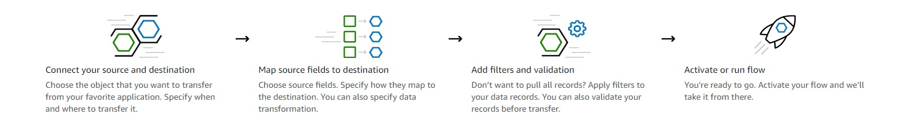
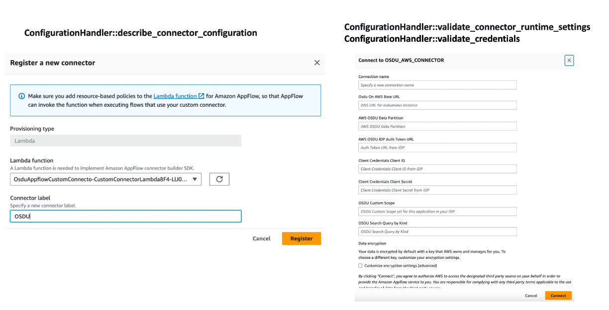
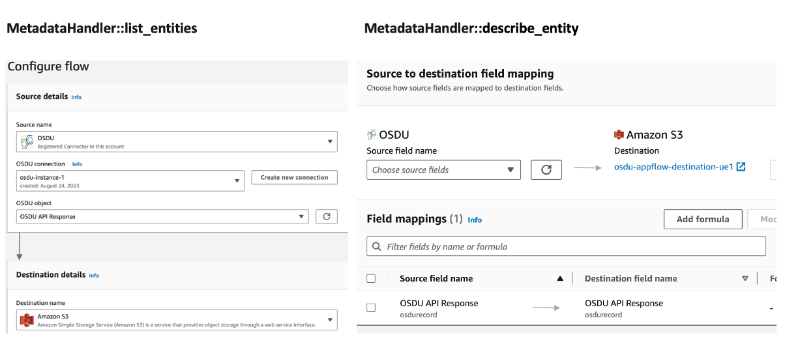
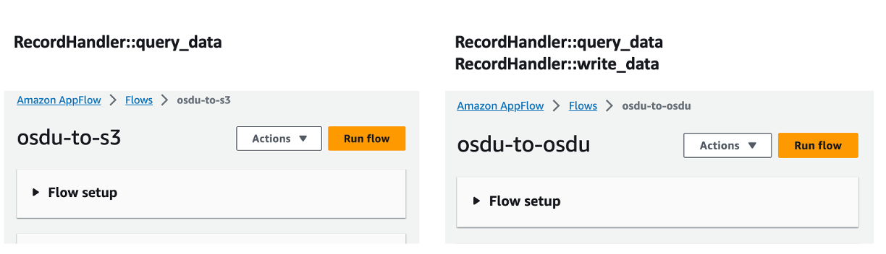

# Amazon AppFlow Custom Demo Connector for OSDU

## About OSDU
OSDU  provides an open source technology-agnostic data platform for the energy industry. OSDU platform support most datatypes found in the energy industry. To learn more about OSDU visit [here](https://osduforum.org/). To know more about OSDU™ Data Platform on AWS visit [here](https://aws.amazon.com/energy/osdu-data-platform/). 

## About Amazon AppFlow
[Amazon AppFlow](https://aws.amazon.com/appflow/) is a fully-managed integration service that enables you to securely exchange data between software as a service (SaaS) applications, such as Salesforce, and AWS services, such as Amazon Simple Storage Service (Amazon S3) and Amazon Redshift. For example, you can ingest contact records from Salesforce to Amazon Redshift or pull support tickets from Zendesk to an Amazon S3 bucket. The following diagram illustrates how it works:



AppFlow can create data flows for services that it does not natively support by leveraging custom connectors. With custom connectors, you can interact with these services from the AppFlow console just like any natively supported connector. To build a custom connector, use the Custom Connector SDK (Python SDK or Java SDK) to implement an AWS Lambda function. This Lambda function will serve as the custom connector, and will be compliant with Lambda's quotas and other requirements.
You can learn more about the Custom Connector SDK [here](https://aws.amazon.com/about-aws/whats-new/2022/02/amazon-appflow-launches-custom-connector-sdk/).

## About AppFlow Custom Connector for OSDU™ Data Platform on AWS
This custom example OSDU Appflow connector supports both source and destination modes. OSDU custom connector runs search query provided by the user on a source OSDU instance and exports/ingests the resulting OSDU records to Destination services like Amazon S3 or another OSDU instance. 

## Appflow Custom Connector Implementation Details

The process for deploying and using the Appflow custom connector is as follows:

1. Implement and deploy Lambda functions to be used as custom connectors.
2. Registering Custom Connector using AppFlow Console or AWS
3. Creating one or more [connections](https://docs.aws.amazon.com/appflow/latest/userguide/connections.html) using the registered connector.
4. Creating one or more [flow](https://docs.aws.amazon.com/ja_jp/appflow/latest/userguide/flows.html) using registered connector and connections

It is necessary to implement the following three Classes and methods within each Class in Custom Connector Lambda Function. 


### ConfigurationHandler:

#### <i>describe_connector_configuration</i> method:

<strong><i>describe_connector_configuration</i></strong> defines the capability of the connector such as supported modes, supported Auth types, scheduling frequencies, runtime settings of different scopes(source mode, destination mode, both and connector profile) etc., This information is fetched during connector registration process and stored in AppFlow connector registry. Using this information Amazon AppFlow UI renders the connector and navigate the user accordingly.

#### <i>validate_connector_runtime_settings</i> and   <i>validate_credentials</i> methods:

A successful registration of a connector enables user to create connector profile according to the supported Auth types and flows according to supported modes. A successful connector profile includes validating the user credentials and connector profile runtime settings. During this process Amazon AppFlow invokes <strong><i>validate_credentials</i></strong> to validate the user credentials and <strong><i>validate_connector_runtime_settings</i></strong> with connector_profile scope to validate the runtime settings. 
  
Screenshot from Amazon AppFlow Custom Demo Connector for OSDU


### MetadataHandler

Amazon AppFlow deals with metadata of the object to create proper query for fetching the data from source and apply the transformations given in the flow tasks. AppFlow restricts users to use only the entities defined the listEntities for both source and destination modes in the flows. Also restricts users to use only the fields and its properties defined in the describeEntity in tasks in order to apply the transformations such as mapping, masking, filtering etc., during data processing step of the flow execution. The properties of the entity such as datatype, queryable, updatable etc., helps customers to define the filter condition, mapping tasks and flow triggers correctly.

#### <i>list_entities</i>  method:

<i>list_entities</i> is called during flow creation and returns a list of schema definitions (Entity). This Entity is defined for each supported API.

#### <i>describe_entity</i> method:
describe_entity is called in data field mapping when creating a flow and returns the field definition.

Screenshot from Amazon AppFlow Custom Demo Connector for OSDU

       

### RecordHandler

AppFlow’s Flow execution for a custom connector mostly depends on the implementation of of this RecordHandler interface. This is where we expect customers to implement the core functionality of making requests source/destination application in order to get/post data. 

#### <i>query_data</i>  method:

<i>query_data</i> is called when the flow is run to get the fields defined in the flow.
In this OSDU custom connector example,  we make a call to OSDU search API in <i>query_data</i> function,  get the record Id from the result and then get the storage record and return the results.

#### <i>write_data</i>  method:

<i>write_data</i> is called when the the flow is run to write the fields to the supported destination connector.
If a flow has destination connector as another OSDU instance or other supported destination connector, <i>write_data</i>  ingests storage records into destination connector.

Screenshot from Amazon AppFlow Custom Demo Connector for OSDU


## Deploying the AppFlow Custom Demo Connector for OSDU

### Requirements
* AWS CLI already configured with Administrator permission
* Docker Desktop running locally 
* [NodeJS installed](https://nodejs.org/en/download/)
* [AWS CDK installed](https://docs.aws.amazon.com/cdk/latest/guide/getting_started.html)

### Deployment

1. Clone the repository 
  ```
  git clone https://github.com/srihariph/osdu-appflow-custom-connector.git
  ```
2. Navigate to Project directory

  ```
  cd osdu-appflow-custom-connector
  ```
3. Install Dependencies
  ```
  npm install
  ```
4. Deploy AppFlow Custom Demo Connector for OSDU
  ```
  cdk deploy --all
```
